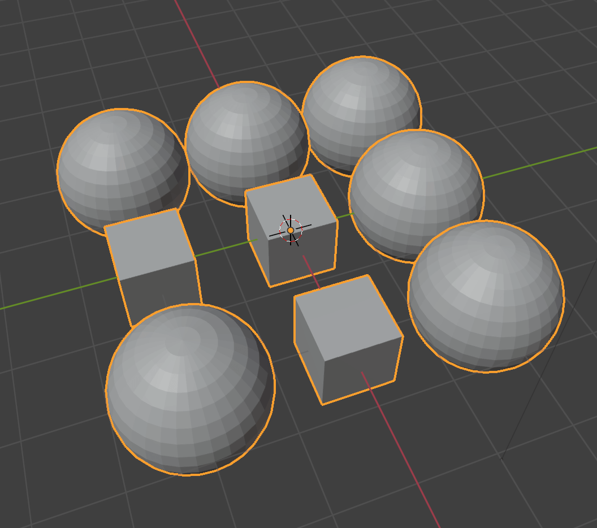
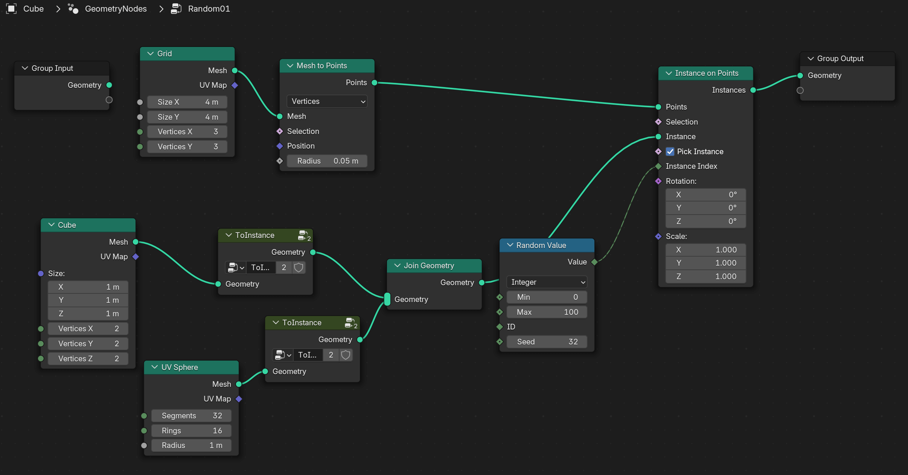
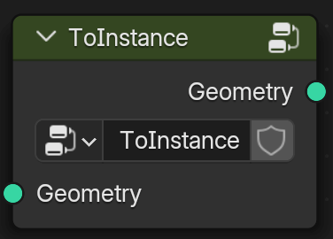

# Blender Node Group Collection

Collection of node groups (for shader or geometry nodes)

## List of node groups

- [ClampVector (for shader)](#clampvector-for-shader)
- [ToInstance (for geometry nodes)](#toinstance-for-geometry-nodes)

## Install

- Install [Node Presets](https://extensions.blender.org/add-ons/node-presets/) addon from blender extension.
- Copy `xxx.blend` file into your directory of Node Presets.
- You can now add my utility nodes by "Node > Add > Template > XXX".

## Usage

### ClampVector (for shader)

Clamps vector by min / max.

### ToInstance (for geometry nodes)

Make geometry into single instance. This is useful when creating instance collection for `Pick Instance` on `Instance On Points`. (For detail, see the movie below.)

https://www.youtube.com/watch?v=nReSOasTuYs

## License

WTFPL