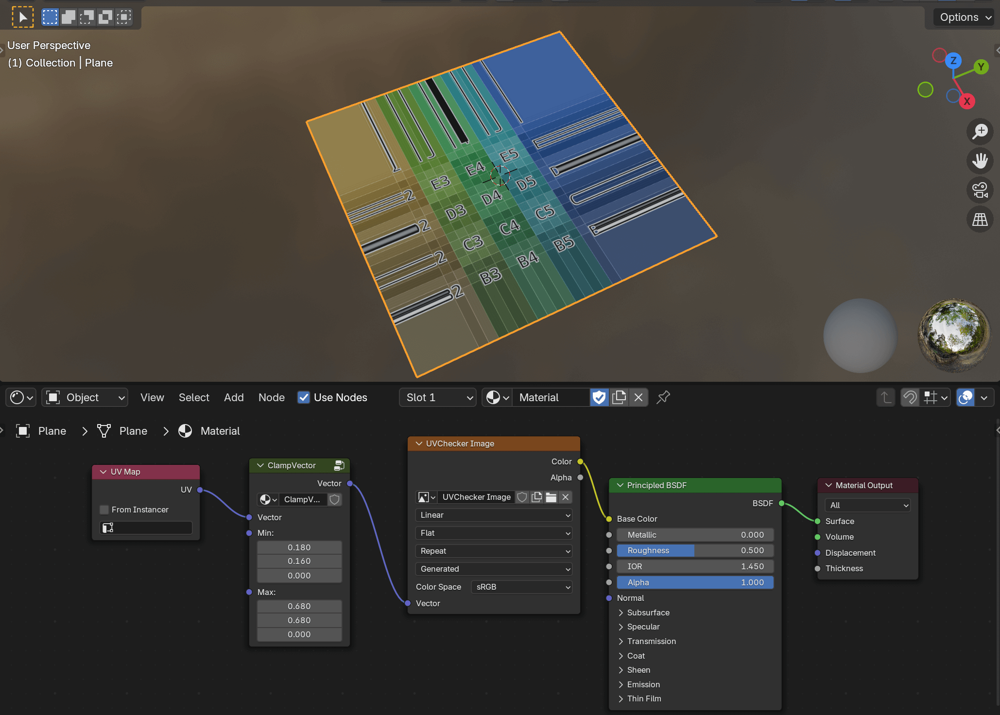

# Blender Shader Utilities

Collection of my shader utilities (node groups)

(For full list of nodes, see [Usage](#usage).)

## Install

- Install [Node Presets](https://extensions.blender.org/add-ons/node-presets/) addon from blender extension.
- Copy `xxx.blend` file into your directory of Node Presets.
- You can now add my utility nodes by "Node > Add > Template > XXX".

## Usage

### ClampVector

Clamps vector by min / max.

## License

WTFPL