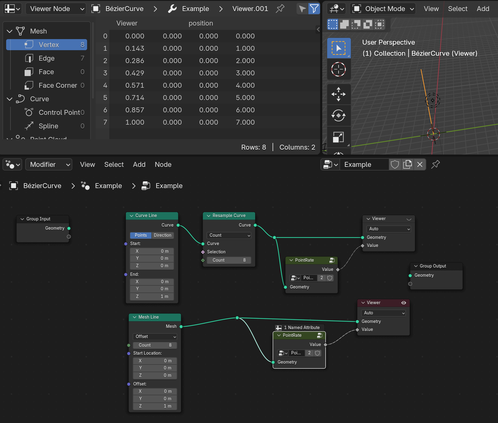
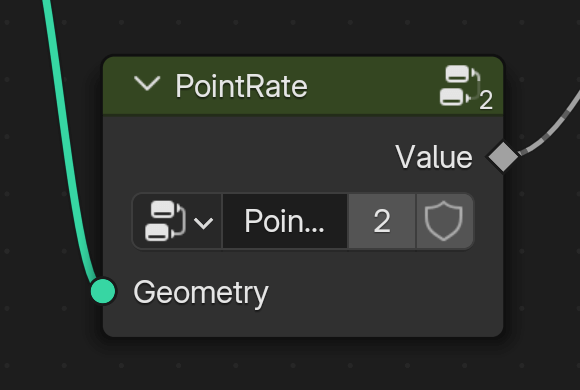
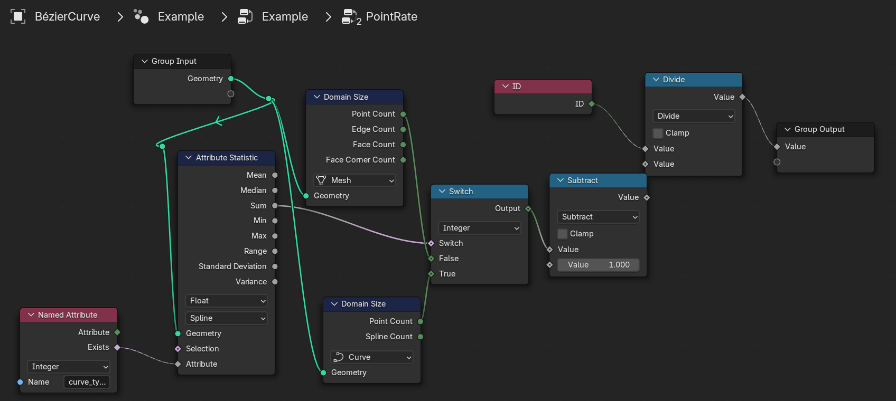

# Blender Node Group Collection

Collection of node groups (for shader or geometry nodes)

## List of node groups (Table of Contents)
- [:pushpin: ClampVector (for shader)](#pushpin-clampvector-for-shader)
  - [Implementation](#implementation)
- [:pushpin: PointRate (for geometry nodes)](#pushpin-pointrate-for-geometry-nodes)
  - [Implementation](#implementation-1)
- [:pushpin: ToInstance (for geometry nodes)](#pushpin-toinstance-for-geometry-nodes)
  - [Implementation](#implementation-2)

## Install

- Install [Node Presets](https://extensions.blender.org/add-ons/node-presets/) addon from blender extension.
- Put `xxx.blend` file into your directory of Node Presets.
- You can now add my utility nodes by "Node > Add > Template > XXX".

## Usage

### :pushpin: ClampVector (for shader)

Clamps vector by min / max.

#### Implementation

### :pushpin: PointRate (for geometry nodes)

Get rate of point (ID / count) from mesh or curve

(always returns 0.0 to 1.0 on each points, in order by ID)

#### Implementation

### Side note

- to detect of mesh or curves, used reference: https://blender.stackexchange.com/questions/305209/geometry-nodes-how-to-check-object-type

### :pushpin: ToInstance (for geometry nodes)

**DEPRECATED**: use [Geometry to Instance](https://docs.blender.org/manual/en/latest/modeling/geometry_nodes/geometry/geometry_to_instance.html) node instead.

Make geometry into single instance. This is useful when creating instance collection for `Pick Instance` on `Instance On Points`. (For detail, see the movie below.)

https://www.youtube.com/watch?v=nReSOasTuYs

#### Implementation

## License

WTFPL
